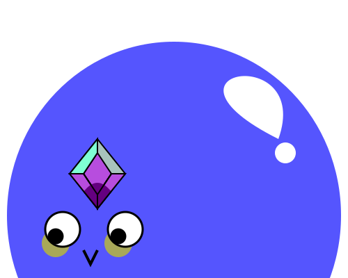

# pebblesona
Yuki Pebblesona "coded" as SVG



## About

The fans of VTuber [Koseki Bijou](https://twitter.com/kosekibijou) are called **Pebbles**. As part of her first livestream fans are asked to draw their own pebble. As I'm really not good at drawing I tried to create a pebble using graphics that can be "coded" inside a SVG graphics file. You can find this file called **pebblesona.svg** in the root folder of this repository.

## Free use and adjustments

The **pebblesona.svg** file is licensed under **CC0 1.0 Universal** (Public Domain). You can save/download the file, use and/or adjust it. To adjust the graphic you can open it with a fitting editor (like IDE or text editor) and open the SVG file with it. Inside you find the definition for the objects as well as some comments. 

Example:
If you want to change the body color of the pebble
```svg
<!-- Pebble body -->
<ellipse cx="250" cy="310" rx="240" ry="250" fill="#5555fe" />
```
you can adjust the **fill** attribute here to the wanted color, e.g. to **90EE90** which is a light green color. 

You might also be able to open and adjust this file with a graphic application.